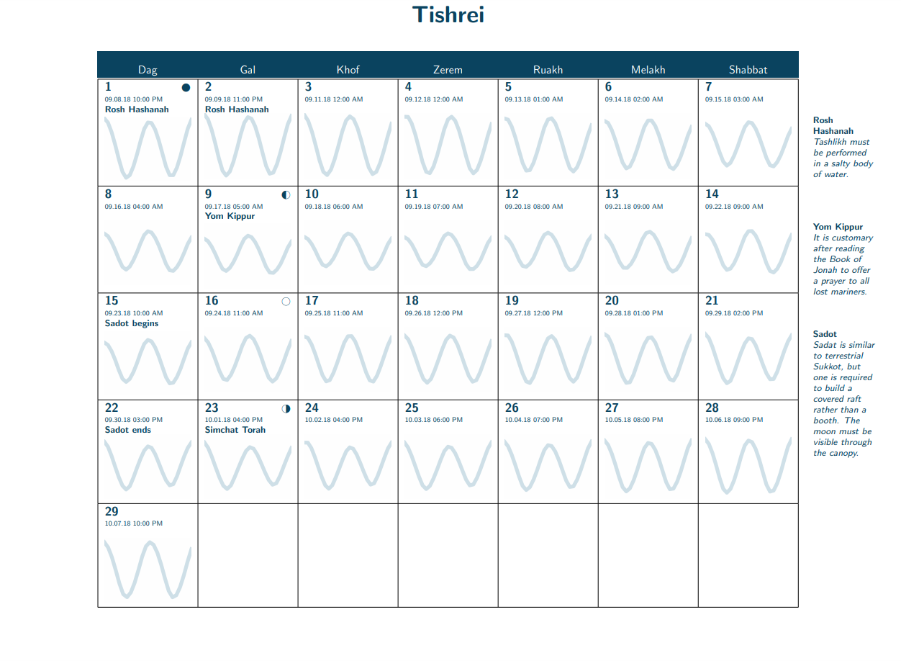

# The Aquatic Jewish Calendar



**[Download the calendar here.](https://github.com/subalterngames/AquaticCalendar/releases/tag/v1.0)**

I recently attempted to research Aquatic Judaism for a personal project, but soon realized that almost no information about the religion exists on the Internet. In response, I've created this Aquatic Jewish calendar specifically for Terrestrial Jews, as an educational aid to better understand their Aquatic brethren.

The Terrestrial and Aquatic Judaism calendars differ in some crucial respects. The secular (Gregorian) calendar is _solar_: days, months, and years are based on the Earth's movement around the Sun. The Terrestrial Jewish calendar is _lunisolar_: Each month starts at a new moon, and each day starts at sunset. The Aquatic Jewish calendar is _lunitidal_: Each month starts at a new moon, and each day starts at high tide.

The sinusoidal waves on this calendar are graphs of predicted tidal heights in Boston, Massachusetts. For most observant Aquatic Jews, this alone is insufficiently accurate. The prudent Aquatic Jew will listen for the sound of the shofar at hide tide to determine when the day has begun or ended.

All images in this calendar are from the [Met's open access collection](https://www.metmuseum.org/art/collection)

All tidal data was gathered from the [NOAA website](https://tidesandcurrents.noaa.gov/waterlevels.html?id=8443970)

## Creating Your Own Aquatic Calendar

**Email subalterngames at gmail dot com and I'll happily create a calendar for you.** 

If you want to try making your own calendar, this repo contains most of the tools required.

### Required Software

- python3
  - pathlib
  - matplotlib
  - dateutil
  - argparse
- LaTeX
  - scrbook
  - colorbtl
  - tabularx
  - marginnote
  - graphicx
  - wasysym
  - sectsty
  - xcolor 
  - background

### How to run the program

```python
python3 aquatic_calendar_creator.py
```

This will generate a `.tex` file, which you can then turn into a pdf with LaTeX.

### Optional arguments

| Argument | Description | Default |
| --- | --- | --- |
| `-t <path>` | path/to/your/tidal/data.csv | `tide_data/boston.csv` |
| `-p` | Create new tidal grap images. | `False` |

### Getting tidal data
This repo does not contain the tools needed to get tidal data. I went to the NOAA website, set the range to 1 year (September 9 2018 to September 9 2019), set the location to Boston, the increment to one hour... And then highlighted the results with my mouse and copy-pasted into Excel.

There is probably a more elegant way to do this.
