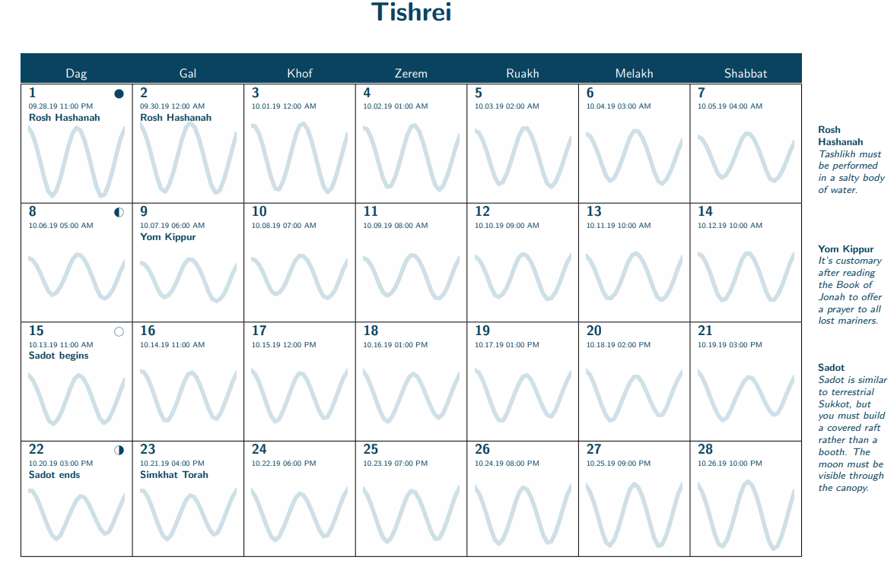

# The Aquatic Jewish Calendar



**[Download the calendar here.](https://github.com/subalterngames/AquaticCalendar/releases/tag/v1.0)**

I recently attempted to research Aquatic Judaism for a personal project, but soon realized that almost no information about the religion exists on the Internet. In response, I've created this Aquatic Jewish calendar specifically for Terrestrial Jews, as an educational aid to better understand their Aquatic brethren.

The Terrestrial and Aquatic Judaism calendars differ in some crucial respects. The secular (Gregorian) calendar is _solar_: days, months, and years are based on the Earth's movement around the Sun. The Terrestrial Jewish calendar is _lunisolar_: Days are based on the Earth's movement around the Sun, while months and years are based on the phases of the Moon. The Aquatic Jewish calendar is _lunitidal_: Days are based on the local high tides, while months and years are based on the phases of the Moon.

Aquatic Judaism varies by region and denomination in a manner similar to Terrestrial Judaism, but the boundaries between the groups are looser, as befits a people that lives beyond national borders. The notes I've included in this calendar are mostly for Atlantic Aquatic Judaism, which is roughly analogous to Terrestrial Ashkenazi Judaism. That being said, Atlantic Aquatic Jews observe many holy days that the Ashkenazim do not, and vice versa; of the holy days that both groups share, their traditions and practices often differ.

The sinusoidal waves on this calendar are graphs of predicted tidal heights in Boston, Massachusetts. For most observant Aquatic Jews, this alone is insufficiently accurate. The prudent Aquatic Jew will listen for the sound of the shofar at hide tide to determine when the day has begun or ended.

All images in this calendar are from the [Met's open access collection](https://www.metmuseum.org/art/collection)

All tidal data was gathered from the [NOAA website](https://tidesandcurrents.noaa.gov/waterlevels.html?id=8443970)

## Creating Your Own Aquatic Calendar

This repo contains the tools I used to create my Aquatic Jewish calendar. You might want to generate your own calendar in order to have localized tidal information, to update the year, etc. **Email me at subalterngames at gmail dot com and I'll happily create a calendar for you.** If you want to figure it out yourself, here's how:

### How to run the program

```python
python3 tide_plotter.py
```

This will generate a `.tex` file, which you can then turn into a pdf with LaTeX.

### How to generate new tidal graphs
- Scrape some data from the NOAA website (link above) 
-  Change line `210` of tide_plotter.py to the name of the file containing the scraped data.
-  Uncomment line `320` of tide_plotter.py
-  Run tide_plotter.py

You can also change the images used by replacing them in the `ocean_images/` folder.

### Required Software

- python3
  - pathlib
  - matplotlib
  - dateutil
- LaTeX
  - scrbook
  - colorbtl
  - tabularx
  - marginnote
  - graphicx
  - wasysym
  - sectsty
  - xcolor 
  - background
